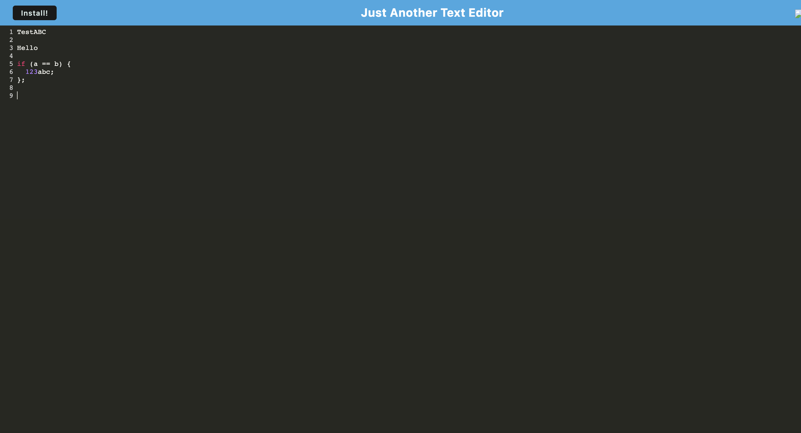

# Just Another Text Editor (J.A.T.E)

## Badges

## Description
A simple text editor, allowing the user to take notes with Javascript syntax highlighting.

## Table of Contents
- [Link to Application](#link-to-application)
- [Installation](#installation)
- [Screenshot](#screenshot)
- [License](#license)
- [Questions](#questions)

## Link to Application
- [Application Link](https://stormy-tundra-71993-6dbb8682ee7a.herokuapp.com/)

## Installation
 To install the text editor on your machine, simply open the link above, then click the 'Install!' button on the top-left corner of the page.

## Screenshot

## License
All assets and code are under MIT License unless specified otherwise.

## Questions
Any questions? Visit my GitHub profile at [https://github.com/katyjmt](https://github.com/katyjmt) or email me at [katyjmt@gmail.com](katyjmt@gmail.com).
